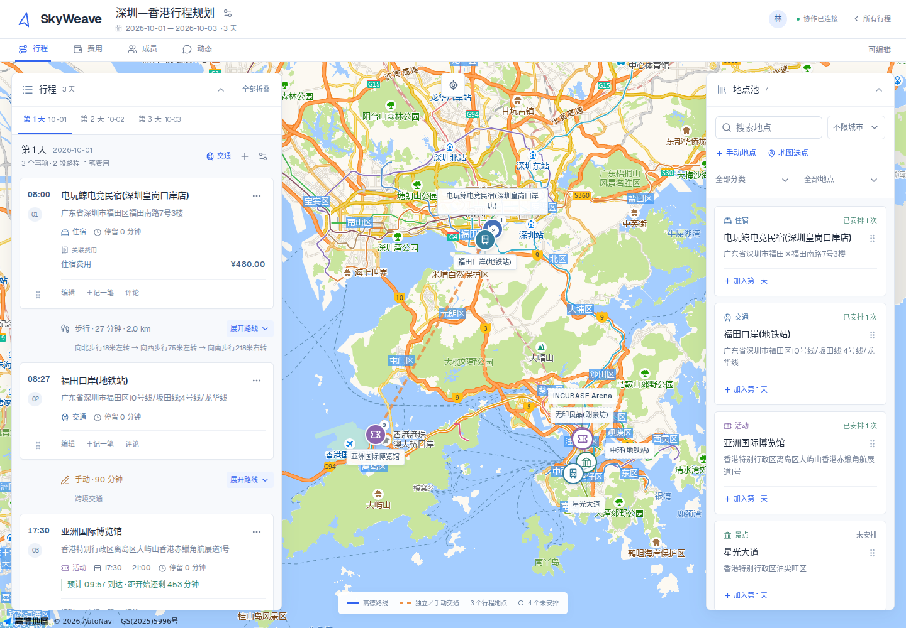
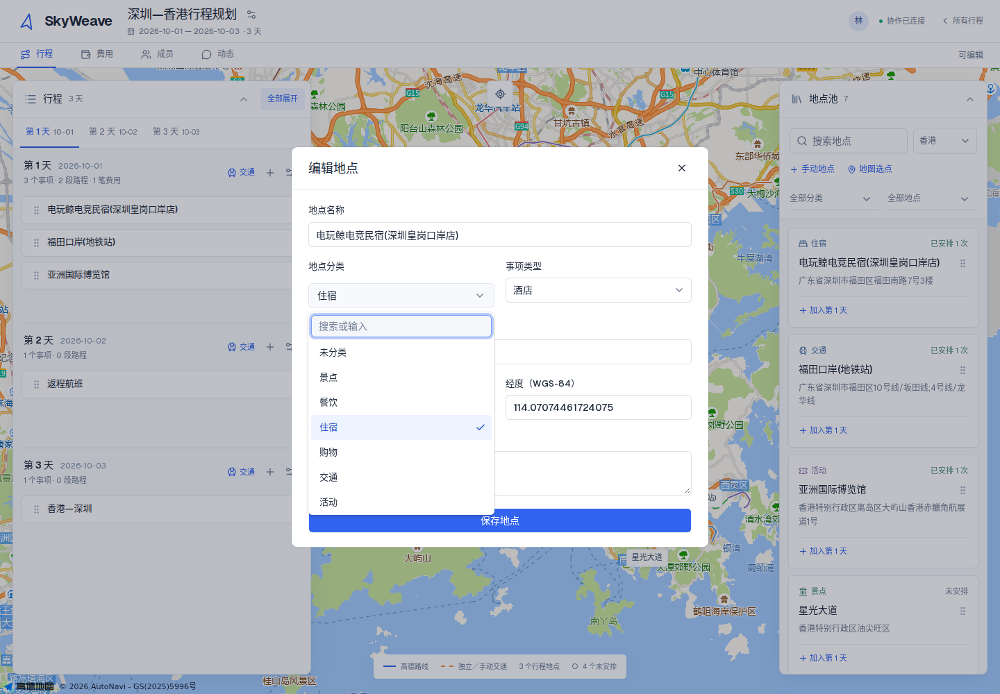

# SkyWeave 组件与主题

## 组件基础

使用 [shadcn/ui](https://ui.shadcn.com/docs/components) 的 Base UI / Nova 组件，配置保存在 `components.json`。当前接入 shadcn 4.21、Base UI 1.8；组件源码位于 `src/components/ui/`，可按项目需要维护。

| 界面 | 基础组件 |
| --- | --- |
| 主要操作、输入和标签 | Button、Input、Textarea、Label |
| 普通下拉、复选框 | NativeSelect、Checkbox |
| 城市、分类及自定义值 | Combobox |
| 桌面编辑表单 | Dialog |
| 手机编辑表单 | Sheet，底部展开 |
| 事项操作菜单 | DropdownMenu |
| 删除确认 | AlertDialog |
| 操作提示 | Tooltip |

弹窗、菜单和下拉的焦点管理、键盘导航、浮层定位由 Base UI 处理。`searchable-select.tsx` 仅维护应用选项、过滤和自定义值，不再手动监听整个文档的键盘或滚动事件。菜单浮层标记 `data-no-drag`，避免点击菜单触发卡片拖动。

地图、卡片内容、日历以及拖动排序属于应用自身布局，继续使用现有高德适配与 dnd-kit。

## 视觉规范

- 白色表面、浅灰背景、蓝色 `#3264ef` 作为主要强调色。
- 使用 Geist；中文回退到系统中文无衬线字体。字体由 Next.js 在构建时处理，运行时从应用自身提供。
- 正文约 14px，表单与操作约 13–14px，标题约 18px；时间与金额采用等宽数字。
- 基础圆角 6px，面板与弹窗约 8–9px；以细边框和轻阴影区分层级。
- 普通控件高 36px，紧凑按钮按场景使用较小规格，手机输入保持可读字号。
- 手机表单采用底部抽屉；地图上的行程与地点池继续保持独立浮层，以支持跨面板拖动。

## 样式组织

- `src/app/globals.css`：语义颜色、字体、圆角及全局基础规则。
- `src/styles/layout.css`：行程、地图、费用等应用布局，清理了旧弹窗、搜索下拉和重复声明。
- `src/styles/skyweave.css`：应用布局的统一主题规范。
- `src/components/ui/`：shadcn 组件及其 Tailwind 样式。

布局样式放在 `components` 层，组件工具类可以明确覆盖。新增控件优先复用现有组件；避免继续添加针对所有 `button`、`input` 的业务样式，或重写通用浮层的键盘与定位逻辑。

## 验证

52 项单元与集成测试、11 套端到端场景覆盖原有行程、协作与费用行为，并增加了嵌套下拉、焦点约束和返回、取消与确认删除、嵌套确认、手机抽屉及复选框提交验证。

升级不修改业务数据结构、密钥配置或 SQLite 持久卷。第三方许可见 `licenses/` 和 `THIRD_PARTY_NOTICES.md`。

## 界面预览

截图使用隔离的界面验证数据。

[手机编辑抽屉](images/design-system-mobile-sheet.png) · [统一删除确认](images/design-system-confirmation.png)
