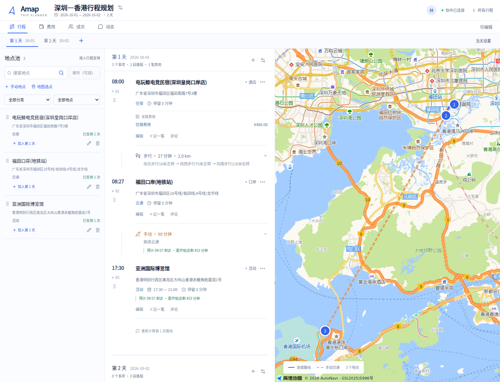
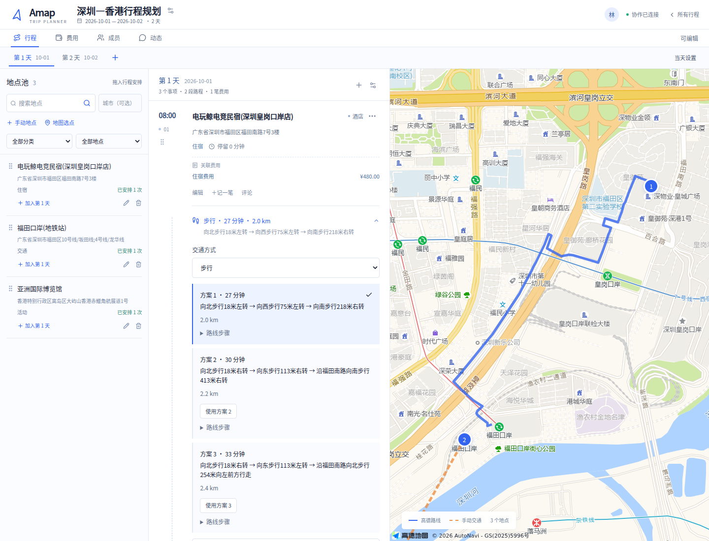

# 地点池与连续规划

这次更新统一处理规划页的九项反馈：

1. 新增一天自动递增名称和日期；可在当天设置中修改。迁移时根据已有日期或 Trip 开始日期补齐旧数据中的未填日期，不覆盖已填写日期。
2. 合并行程标题、日期摘要和成员状态，桌面顶部缩至约 96px，日期切换移入悬浮行程面板。
3. 搜索位于地点池固定区域，时间线或地点列表滚动时仍可操作。
4. 搜索结果先收藏到 Trip 级地点池，拖入行程后保留，并显示安排次数。也提供按钮，方便触屏和键盘操作。
5. 提供常用地点分类及自定义分类，支持按分类、已安排/未安排筛选。拖入行程时继承分类，后续可分别编辑。
6. 展开、修改、重算交通段或切换方案时，地图自动适配两端与当前路线；选择池中地点也可定位预览。
7. 多日共用连续滚动时间线，日期与地图跟随当前天。支持跨日拖动和菜单移动，不自动创建跨 Day 交通段。
8. 事项下显示关联账单的名称和金额；点击可编辑或查看。跨日移动时账单关联保持一致。
9. 固定时间事项及展开后的入站交通段显示预计到达时间、剩余时间或迟到时间。未知交通时长会明确标记，不能当作零。

## 数据与迁移

新增 `trip_places`、事项来源及分类字段。旧行程中的有坐标地点整理到地点池；同一 Trip 的同一高德 POI 合并为一个池中记录，原事项、时间和费用保留。删除池中地点仅解除来源关联。

新增与移动操作都校验成员权限、Trip 归属和版本。跨日移动在一个事务中修改事项、账单日期、两天的顺序和交通段。

## 验证

新增自动日期、分类、重复使用、插入位置、跨日移动、账单归属和旧数据库迁移测试。浏览器覆盖完整收藏—拖入—重复安排流程、连续滚动、固定搜索、路线聚焦、固定活动余量变化，以及直接打开关联账单。

真实高德地图使用近距离的深圳两点和远端香港地点核对：展开深圳段后，地图确实放大并定位到该段。桌面和 320–1440px 响应式布局使用隔离数据检查。

