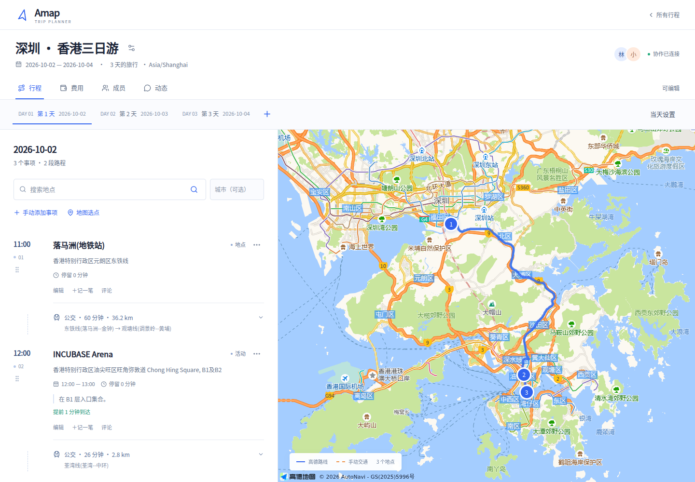
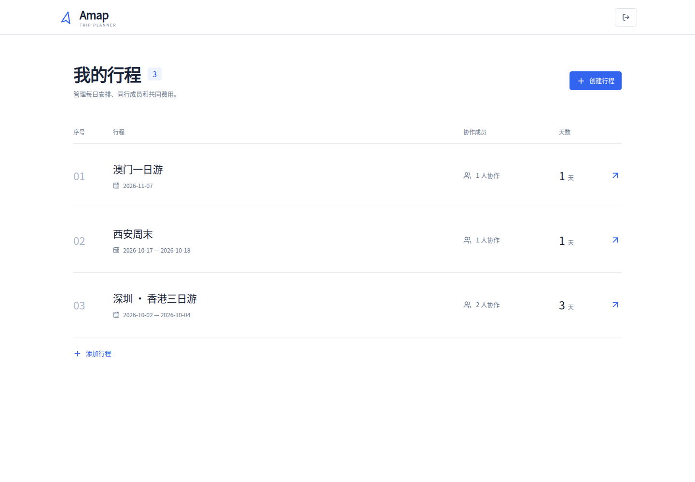

# 界面与文案规范

## 视觉

- 以白色为底，蓝色 `#3264ef` 用于主要操作、选中状态和路线；青绿、橙色用于金额状态和分类区分。
- 用字号、间距和细分隔线组织内容。行程、成员和账单采用开放式行布局，避免每一段信息都套卡片。
- 小圆角主要用于输入框和按钮（约 5px）、浮层（8–10px）。头像与地图编号可以使用圆形。
- 时间与地点并排显示，金额优先突出。移动端成员账单分两行展示，余额无需横向滚动。
- 明确呈现选中、悬停、键盘焦点、错误和禁用状态。

## 文案

- 页面标题直接描述功能，例如“我的行程”“费用与结算”“同行成员”。
- 提示只说明状态、结果或下一步操作，避免口号、装饰性英文标题和拟人化加载文案。
- 权限、固定时间、分摊及结算说明保持准确；精简文案时保留必要条件。

## 核对记录

已核对登录、行程列表、规划、费用、成员和动态页面的桌面及移动端效果。行程和费用页面检查宽度为 320、390、768、900、1024、1440px；移动端余额均在视口内。原有四套 Playwright 场景通过，类型检查、lint、生产构建和 Docker 构建通过。

截图使用独立的界面验证数据：

[移动端费用与余额](images/ui-expenses-mobile.png)
