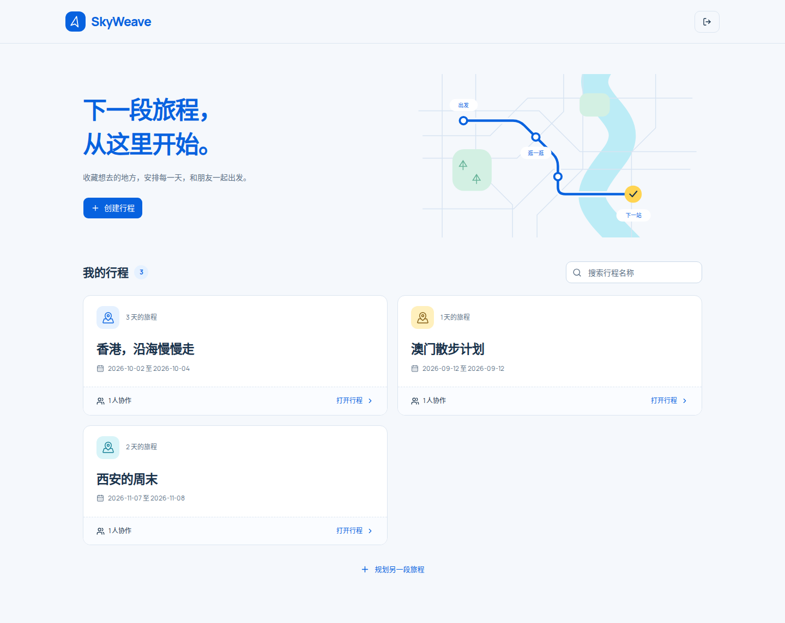
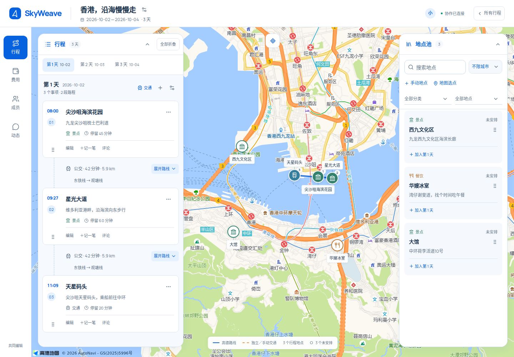

# 界面与文案规范

## 规划工作区

采用「城市漫游手册」视觉方向，完整配色、字体、组件与布局说明见[设计系统](design-system.md)。地图界面保留两个可折叠工具面板，桌面使用侧边导航。

- 地图铺满工作区，桌面左侧行程、右侧地点池悬浮，各自独立折叠。桌面顶部行程标题高 76px，左侧导航宽 88px。
- 折叠保留面板内的筛选、输入和展开状态。面板位置变化后，路线和地点聚焦会重新避让面板。
- 手机使用地图上方的地点池／行程／地图切换；行程作为底部面板。地点池模式同时显示上下两个面板，支持拖入行程。
- 地点池使用浅蓝白色收藏条目，时间线使用白色事项与交通连接线；浮动面板约 18px 圆角，控件约 8px 圆角，轻阴影只用于浮层。
- 晴空蓝 `#0762DF` 用于主要操作、选中地点和路线；分类保留独立图标和颜色，日光黄用于局部强调。正文与标题优先，操作和辅助信息保持次要层级。
- 固定活动的到达余量常驻事项卡片；展开路线后显示对应余量，便于切换方案时比较。

## 拖动与可访问性

- 鼠标从卡片表面或标题拖动，移动超过 7px 才开始；点击标题仍定位地图。编辑、删除、账单等独立按钮不会触发拖动。
- 手机长按 250ms 后拖动；提前滑动用于滚动。保留键盘拖动手柄及 Alt + 上下方向键排序；Alt + 鼠标可选择卡片文本。
- 地点池内排序持久化并同步给同行成员；拖入行程后保留池中地点并显示使用次数。
- 在筛选后的地点池中，键盘移动针对可见地点，未显示地点的相对顺序保持不变。
- 更多操作菜单支持点击外部关闭和 Escape 返回触发按钮；面板开关具有展开状态与受控区域标识。
- 路线候选放在独立滚动区域，避免一次展开大量方案拉长整条时间线。

## 文案

页面标题直接描述功能。提示只说明状态、结果或下一步操作，避免口号、装饰性英文标题和拟人化加载文案。精简文字时保留权限、固定时间、分摊与结算的必要条件。

## 界面预览

截图使用隔离的演示账号和行程数据。

[手机行程](images/field-guide-plan-mobile.png) · [费用与结算](images/field-guide-expenses.png) · [手机费用](images/field-guide-expenses-mobile.png) · [成员](images/field-guide-members.png) · [协作动态](images/field-guide-activity.png)

地图默认加入未安排地点，名称常驻并自动避让；常用分类使用不同图标，自定义分类显示首字。独立交通的暂定状态使用普通元数据，尚未填写的地点和时间不堆叠警告卡片。详见[地图地点与独立交通](map-and-transport.md)。

产品名为 SkyWeave。日期由行程范围管理；精简排序、搜索下拉和明确的路线折叠入口见[日历与规划操作](calendar-and-controls.md)。

基础控件已迁移为 shadcn/ui 的 Base UI / Nova 方案，颜色、字体和圆角统一到语义主题。编辑表单在桌面采用 Dialog、手机采用底部 Sheet，详见[组件与主题](design-system.md)。
