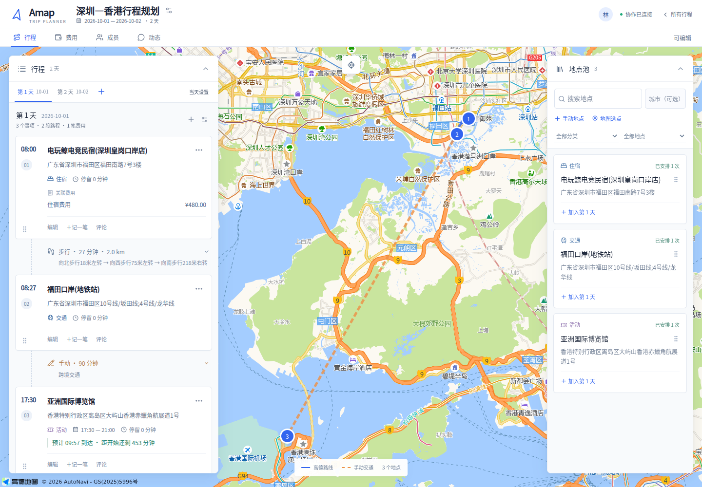
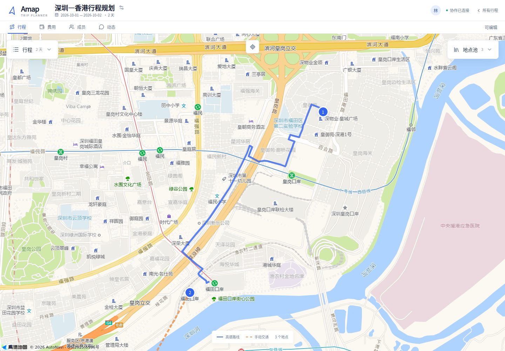

# 界面与文案规范

## 规划工作区

参考 [liketrek/TREK](https://github.com/liketrek/TREK) 的地图主界面组织方式，使用现有 Next.js 组件自行实现，不复用其业务代码。

- 地图铺满工作区，桌面左侧行程、右侧地点池悬浮，各自独立折叠。顶部标题与导航合计约 96px。
- 折叠保留面板内的筛选、输入和展开状态。面板位置变化后，路线和地点聚焦会重新避让面板。
- 手机使用地图上方的地点池／行程／地图切换；行程作为底部面板。地点池模式同时显示上下两个面板，支持拖入行程。
- 地点池与时间线使用统一的轻量卡片：细边框、6px 小圆角、白色表面；面板采用 8px 圆角和轻阴影。路线、金额和元数据不再逐层套卡片。
- 蓝色 `#3264ef` 用于主要操作、选中地点和路线；青绿、橙色、紫色区分地点分类。正文与标题优先，操作和辅助信息保持次要层级。
- 固定活动的到达余量常驻事项卡片；展开路线后显示对应余量，便于切换方案时比较。

## 拖动与可访问性

- 鼠标从卡片表面或标题拖动，移动超过 7px 才开始；点击标题仍定位地图。编辑、删除、账单等独立按钮不会触发拖动。
- 手机长按 250ms 后拖动；提前滑动用于滚动。保留键盘拖动手柄及 Alt + 上下方向键排序；Alt + 鼠标可选择卡片文本。
- 地点池内排序持久化并同步给同行成员；拖入行程后保留池中地点并显示使用次数。
- 在筛选后的地点池中，键盘移动针对可见地点，未显示地点的相对顺序保持不变。
- 更多操作菜单支持点击外部关闭和 Escape 返回触发按钮；面板开关具有展开状态与受控区域标识。
- 路线候选放在独立滚动区域，避免一次展开大量方案拉长整条时间线。

## 文案

页面标题直接描述功能。提示只说明状态、结果或下一步操作，避免口号、装饰性英文标题和拟人化加载文案。精简文字时保留权限、固定时间、分摊与结算的必要条件。

## 验证

39 项单元与集成测试通过；7 套 Playwright 场景覆盖协作、费用、连续规划、整卡排序、折叠、筛选保留、刷新以及真实触摸滚动与长按排序。真实高德地图验证了当前路线两端均处于左右面板之间；320、390、768、900、1024、1440px 无横向溢出。

截图使用隔离的界面验证数据，不包含真实账户资料。

[移动端行程](images/planner-floating-mobile.png) · [移动端地点池](images/planner-floating-mobile-pool.png)
