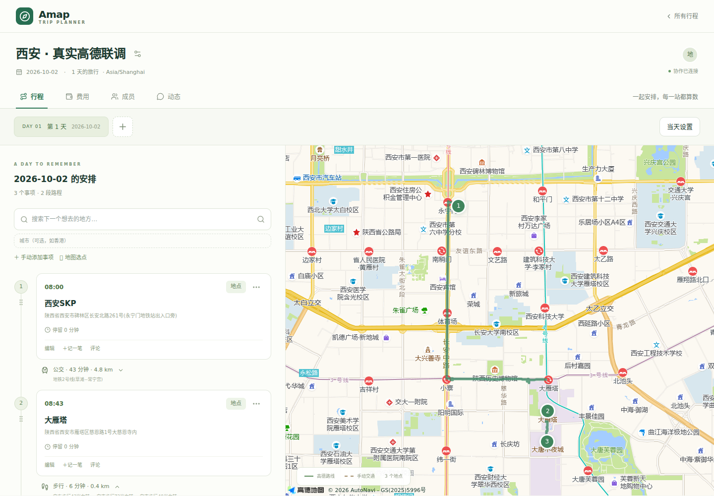
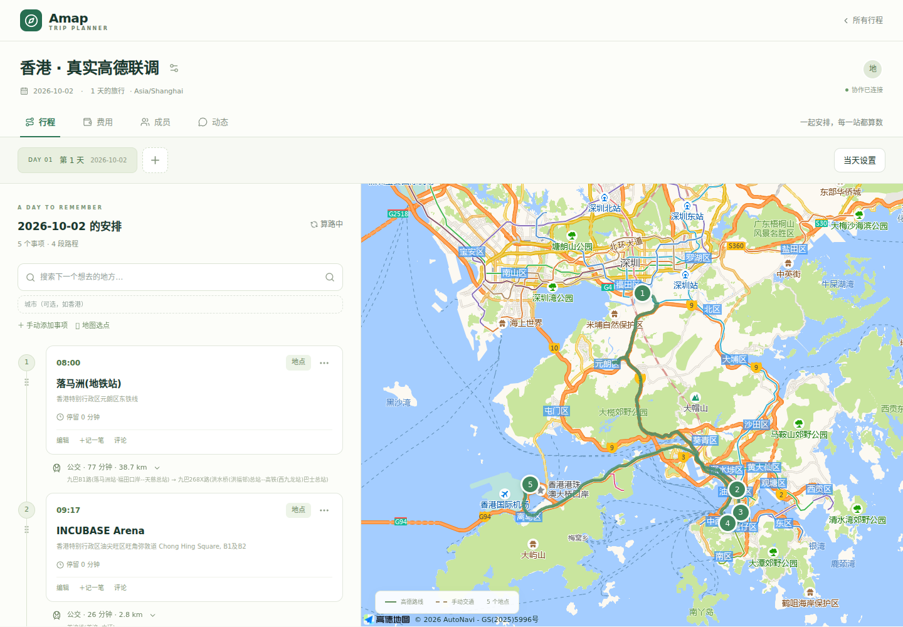
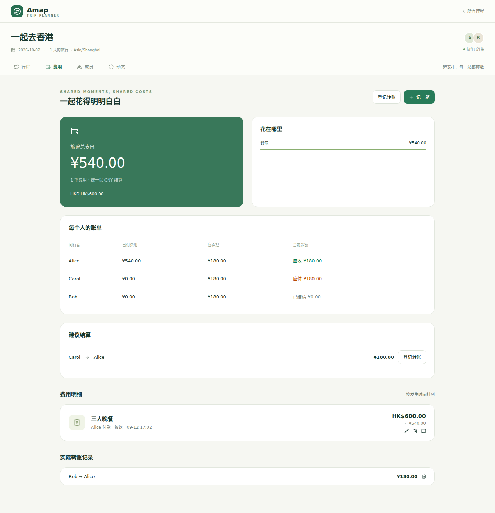

# v0.1 验收记录

日期：2026-09-12。环境：Node.js 22、Next.js 16.3.5、Chromium、SQLite、Docker。自动化测试使用独立数据库；真实高德测试使用本地配置，密钥未写入报告或提交。

## 行程查看与图片导出补充验收（2026-09-13）

类型检查、ESLint、Prettier、生产构建、68 项单元与集成测试以及完整 19 套 Playwright 场景通过。新增场景验证非编辑查看入口、按天跳转、只读成员导出、固定时间与跨日班次、无日期旧行程、导出失败重试及关闭后的焦点恢复；检查 320、390、768、1024px 宽度没有横向溢出。

实际下载并检查全程及单日 PNG 的文件签名与尺寸；长备注跨图后的末尾文字完整，关闭备注后不进入图片。多图 ZIP 的 UTF-8 文件名、CRC32、目录偏移及所有 PNG 文件均有测试覆盖。截图使用隔离数据：[查看页](images/itinerary-view.png)、[手机查看页](images/itinerary-view-mobile.png)、[导出行程图](images/itinerary-poster.png)。本次未改动数据库结构或新增依赖。

## 自动化

| 检查                              | 结果                                                             |
| --------------------------------- | ---------------------------------------------------------------- |
| TypeScript strict / route typegen | 通过                                                             |
| ESLint                            | 通过，无警告                                                     |
| Vitest                            | 8 个文件，52 项通过                                              |
| Next.js 生产构建                  | 通过                                                             |
| Playwright                        | 11 套场景通过                                                     |
| Drizzle schema 检查               | 与已提交迁移一致，无待生成变更                                   |
| npm audit                         | 0 vulnerabilities                                                |
| Docker 镜像构建                   | 通过                                                             |
| Docker 重启及数据持久化           | 通过                                                             |
| 浏览器资源/镜像配置检查           | 浏览器静态资源无服务端密钥；镜像未包含 `.env.local` 或预置数据库 |

覆盖坐标正反向固定向量、港澳台区域、海外原样返回、原生 POI 映射、公交多候选、缺几何候选、缓存、超时、错误码、频率限制及有限重试；覆盖延迟路线响应被丢弃、候选选择保留、固定时间/未知时间/跨午夜、四种分摊、换汇舍入、金额守恒、大金额编辑不丢分、结算调整，以及邀请过期/撤销/竞争使用、绑定前历史费用、越权与乐观并发。

Playwright 场景：

1. **西安**：酒店、SKP、大唐不夜城、大雁塔、钟楼；搜索添加、四种高德交通、候选与地图同步、键盘移动、真实鼠标拖拽、刷新保存、390px 移动视口与地图切换。
2. **深圳—香港**：民宿、福田口岸、落马洲、INCUBASE、旺角、星光大道、中环、亚博、皇岗口岸；手动段、迟到、跨午夜、复制和刷新保存。23:30 结束仅用于跨午夜测试，不代表演出实际结束时间。
3. **多人费用**：A 创建邀请，B 注册加入；A 新增地点被 B 实时看到，B 修改被 A 看到；HK$600 按 0.9 折为 ¥540，三人平均承担 ¥180，editor 登记 ¥180 转账后余额更新，评论和全部数据刷新后保留。
4. **访问与恢复**：viewer 无编辑入口且 API 拒绝修改；错误 Origin 被拒绝；断线期间的新增事项在恢复连接后补齐；成员被移出后页面撤权，API 返回无访问权限。

5. **连续规划**：新增日期自动递增；搜索先收藏到地点池；自定义分类、拖入空白日期和重复安排；固定搜索区在滚动中可用；跨日滚动切换地图；路线聚焦及候选切换后的时间余量；事项显示账单、跨日移动账单跟随。详情见[地点池与连续规划](planner-update.md)。

## 真实高德 API

十五个搜索目标均成功：西安 SKP、大唐不夜城、大雁塔、钟楼、电玩鲸电竞民宿、福田口岸、落马洲站、INCUBASE Arena、旺角无印良品、星光大道、中环站、亚洲国际博览馆、皇岗口岸、澳门塔、台北 101。

西安 SKP、INCUBASE Arena、澳门塔、台北 101 的输入提示与详情均成功，详情与搜索返回的 WGS-84 坐标一致。

| 端点                    | 模式 | 本次候选数 |
| ----------------------- | ---- | ---------- |
| 西安 SKP → 大雁塔       | 步行 | 3          |
| 西安 SKP → 大雁塔       | 驾车 | 2          |
| 西安 SKP → 大雁塔       | 骑行 | 1          |
| 西安 SKP → 大雁塔       | 公交 | 8          |
| 落马洲站 → 星光大道     | 公交 | 10         |
| 中环站 → 亚洲国际博览馆 | 公交 | 10         |

初次连续搜索遇到高德短期频率限制。加入按 endpoint 节流与单次有限重试后重新验证，十五个目标全部成功。未对每日配额或 Key 错误循环重试。

候选数量随出发时间及高德响应变化，上表为一次真实查询结果，不作为未来查询的固定断言。

## 真实地图

在生产运行方式中使用真实 JS API、底图、POI 和线路完成浏览器核对；西安三个 Marker、香港五个 Marker 均显示，路线与保存的方案联动，浏览器未记录脚本错误。香港路线覆盖落马洲、INCUBASE、尖沙咀、中环和亚博；未发现成片的 GCJ/WGS 偏移。此结论是应用视觉验收，不代表测绘精度验证。

大雁塔 → 大唐不夜城的公交查询实际无结果；界面正确提示，切换步行后返回两个有效方案。没有把无路线情况伪装为零耗时交通。

## Docker

使用隔离测试容器及独立数据卷创建账号、行程、两位参与者、两个事项、手动交通、费用、结算和评论，执行容器重启后逐项核对数量和余额。登录会话继续有效；HK$600 按 0.9 折为 ¥540，两人各承担 ¥270，登记 ¥100 转账后未付余额为 ¥170。

已重新创建容器并保留同一数据卷验证新镜像。正式 Compose 数据卷与测试数据隔离。应用内含迁移初始化，不依赖开发机预先生成数据库。

## 证据与复跑

可用命令见 README。详细本地报告位于 `.tmp/live-amap-results.json`、`.tmp/live-detail-results.json`、`.tmp/live-map-results.json`、`.tmp/docker-validation.json`；Playwright 报告在 `playwright-report/`。这些临时报告和测试会话不提交，仅保留本文件中的非敏感结果及界面截图。

已知限制及后续范围见 README 的 v0.2 部分。

## 悬浮面板与整卡拖动（2026-09-12）

- 39 项单元与集成测试通过，包括地点池排序的版本冲突、越权、跨行程、重复 ID、追加新地点和旧库顺序迁移。
- 7 套 Playwright 场景通过，新增整卡与标题拖动、取消、操作按钮不触发拖动、分类筛选后排序、刷新持久化、独立折叠和输入保留，以及手机真实触摸滚动／长按拖放。
- 真实高德地图确认聚焦两端均落在左右悬浮面板之间；覆盖 320、390、768、900、1024、1440px，无横向溢出和页面异常。
- 类型检查、ESLint、Prettier 和生产构建通过。构建先串行迁移数据库，避免并发构建进程重复执行增列迁移。

- Docker 镜像构建和重建后的健康检查通过；升级前完成 SQLite 在线备份，确认原有行程、事项、成员、费用、结算和评论保留，地点池迁移保留原顺序，外键检查通过。

## 地图地点与独立交通（2026-09-12）

- 48 项单元与集成测试通过。新增地图待安排筛选、交通起终点的地点池身份、名称避让、独立交通接驳请求、未知时长、赶不上班次、跨午夜和来源删除后的历史保留验证。
- 9 套端到端场景覆盖常驻名称、分类图标、地图点击展开地点池、跨日安排状态；完整验证暂定城市、补齐车站和班次、前后接驳、交通类型切换、跨午夜、费用关联及跨日移动。
- 注册测试尊重原有生产限流，收到 429 时按 Retry-After 等待，不关闭或降低认证限流。
- 真实高德地图检查 7 个地点（含 4 个未安排地点）的名称及图标，实际点击定位地点池成功；相近名称错开放置。香港西九龙站、深圳北站实测用于独立交通起终点展示，虚线仅为示意。
- 320、390、768、1024、1440px 无横向溢出；手机表单与暂定航班卡片可用。类型检查、lint、Prettier、生产构建及 Docker 镜像构建通过。
- 本地 Compose 已使用新镜像重建，健康检查正常。升级前在线备份，原有行程、事项、成员、费用、结算、评论及地点池记录保留，SQLite 外键检查通过。

## SkyWeave 日历与规划控件（2026-09-12）

- 52 项单元与集成测试、10 套端到端场景通过。日期范围生成与重排、缩短保护、迁移保留、折叠后的整卡拖动、分类选择、自定义、城市查询参数、下拉键盘操作、路线展开／收起及后台日期自动计算均覆盖。
- 实测精简卡片高 40px；320、390、768、1024、1440px 无横向溢出，真实高德地图和选择弹窗无页面异常。
- TypeScript、ESLint、Prettier、生产构建和 `skyweave:local` Docker 镜像构建通过。认证与高德配置、SQLite 卷路径未更改。
- SkyWeave 镜像已重建本地服务。升级前在线备份；配置为 7 天的既有行程由 3 个 Day 补齐为 7 个，原 Day ID、日期、开始时间及原有事项、路线、账单、结算均核对保留，外键检查通过。

## shadcn/ui 与 Base UI 迁移（2026-09-12）

- 52 项单元与集成测试、11 套 Playwright 场景通过。原有行程、费用、协作、整卡拖动、整天排序及自动路线继续覆盖。
- 新增嵌套下拉 Escape、未提交输入保留、焦点约束与返回、取消与确认删除、设置弹窗内的嵌套确认、手机底部 Sheet，以及复选框与固定时间表单提交验证。
- 真实高德地图上的桌面、搜索下拉与编辑界面核对通过；320、390、768、1024、1440px 无页面横向溢出。
- TypeScript、ESLint、Prettier、生产构建和 Docker 镜像构建通过。shadcn、Base UI 及 Geist 的许可文件纳入仓库。
- 新镜像已在本地 Compose 重建并通过健康检查。升级前在线备份；行程、日期、事项、地点池、成员、参与者、费用、分摊、结算和评论逐表核对未改变，外键检查通过。许可文件随运行镜像提供。
